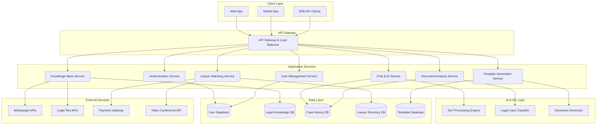
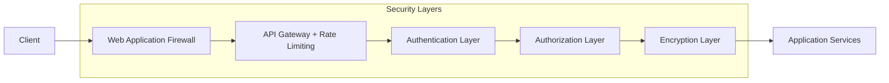

# Design-Dokument: SmartLaw Agent – Mietrecht

## Übersicht

Der SmartLaw Agent – Mietrecht ist eine Cloud-basierte, KI-gestützte Anwendung, die als hybrides System aus automatisierter Rechtsberatung und menschlicher Expertise konzipiert ist. Das System verwendet moderne NLP-Technologie, um deutsche Mietrechtsfälle zu analysieren und Nutzern sowohl sofortige Hilfe als auch nahtlose Anwaltsvermittlung zu bieten.

### Kernprinzipien
- **Datenschutz by Design**: Alle Komponenten sind DSGVO-konform und in Deutschland gehostet
- **Skalierbare Architektur**: Microservices-basiert für flexible Erweiterung
- **Barrierefreiheit**: WCAG 2.1 AA-konform für alle Nutzergruppen
- **Lokale Anpassung**: Berücksichtigung regionaler Rechtsvariationen

## Architektur

### Systemarchitektur-Diagramm



### Technologie-Stack

**Frontend:**
- Web: React.js mit TypeScript, Material-UI für Barrierefreiheit
- Mobile: React Native für iOS/Android
- State Management: Redux Toolkit
- Accessibility: ARIA-Labels, Screenreader-Support

**Backend:**
- Runtime: Node.js mit Express.js
- API: RESTful APIs mit OpenAPI 3.0 Spezifikation
- Authentication: JWT mit Refresh Tokens
- Validation: Joi für Input-Validierung

**AI/ML:**
- NLP Engine: OpenAI GPT-4 oder Azure OpenAI Service
- Document Processing: Azure Form Recognizer + Custom OCR
- Text Classification: Fine-tuned BERT-Modell für deutsche Rechtstexte
- Vector Database: Pinecone für semantische Suche

**Datenbanken:**
- Primary: PostgreSQL für strukturierte Daten
- Cache: Redis für Session-Management und Caching
- Search: Elasticsearch für Volltext-Suche in Rechtsdokumenten
- Files: MinIO für Dokumentenspeicherung

**Infrastructure:**
- Cloud: Deutsche Cloud-Anbieter (IONOS, Hetzner)
- Container: Docker + Kubernetes
- Monitoring: Prometheus + Grafana
- Logging: ELK Stack (Elasticsearch, Logstash, Kibana)

## Komponenten und Schnittstellen

### 1. Authentication Service

**Zweck:** Sichere Nutzerauthentifizierung und Autorisierung

**Schnittstellen:**
```typescript
interface AuthService {
  register(userData: UserRegistration): Promise<AuthResult>
  login(credentials: LoginCredentials): Promise<AuthResult>
  refreshToken(token: string): Promise<AuthResult>
  logout(userId: string): Promise<void>
  verifyEmail(token: string): Promise<boolean>
  resetPassword(email: string): Promise<void>
}

interface UserRegistration {
  email: string
  password: string
  userType: 'tenant' | 'landlord' | 'business'
  acceptedTerms: boolean
  location?: string
}
```

**Sicherheitsfeatures:**
- Passwort-Hashing mit bcrypt
- Rate Limiting für Login-Versuche
- 2FA-Option für Business-Kunden
- DSGVO-konforme Einwilligungsverwaltung

### 2. Chat & AI Service

**Zweck:** Kernkomponente für KI-gestützte Rechtsberatung

**Schnittstellen:**
```typescript
interface ChatService {
  startConversation(userId: string, initialQuery: string): Promise<Conversation>
  sendMessage(conversationId: string, message: string): Promise<AIResponse>
  getConversationHistory(userId: string): Promise<Conversation[]>
  escalateToLawyer(conversationId: string): Promise<EscalationResult>
}

interface AIResponse {
  message: string
  confidence: number
  legalReferences: LegalReference[]
  suggestedActions: Action[]
  escalationRecommended: boolean
  templates?: TemplateReference[]
}

interface LegalReference {
  type: 'law' | 'court_decision' | 'regulation'
  reference: string
  title: string
  relevantSection?: string
  url?: string
}
```

**KI-Pipeline:**
1. **Intent Recognition**: Klassifizierung der Nutzeranfrage
2. **Context Extraction**: Extraktion relevanter Fakten
3. **Legal Analysis**: Zuordnung zu Rechtsbereichen
4. **Response Generation**: Generierung verständlicher Antworten
5. **Confidence Assessment**: Bewertung der Antwortqualität

### 3. Document Analysis Service

**Zweck:** Automatisierte Analyse von Mietdokumenten

**Schnittstellen:**
```typescript
interface DocumentService {
  uploadDocument(file: File, documentType: DocumentType): Promise<UploadResult>
  analyzeDocument(documentId: string): Promise<DocumentAnalysis>
  getAnalysisHistory(userId: string): Promise<DocumentAnalysis[]>
}

interface DocumentAnalysis {
  documentId: string
  documentType: 'rental_contract' | 'utility_bill' | 'warning_letter'
  extractedData: Record<string, any>
  issues: Issue[]
  recommendations: Recommendation[]
  riskLevel: 'low' | 'medium' | 'high'
}

interface Issue {
  type: string
  severity: 'info' | 'warning' | 'critical'
  description: string
  legalBasis?: string
  suggestedAction?: string
}
```

**Analysefähigkeiten:**
- **Mietverträge**: Unwirksame Klauseln, überhöhte Mieten, fehlende Angaben
- **Nebenkostenabrechnungen**: Berechnungsfehler, nicht umlagefähige Kosten
- **Abmahnungen**: Rechtmäßigkeit, Fristen, Reaktionsmöglichkeiten

### 4. Lawyer Matching Service

**Zweck:** Vermittlung zu qualifizierten Mietrechtsanwälten

**Schnittstellen:**
```typescript
interface LawyerService {
  findLawyers(criteria: LawyerSearchCriteria): Promise<Lawyer[]>
  bookConsultation(lawyerId: string, timeSlot: TimeSlot): Promise<Booking>
  transferCaseData(conversationId: string, lawyerId: string): Promise<void>
  rateLawyer(bookingId: string, rating: Rating): Promise<void>
}

interface LawyerSearchCriteria {
  location: string
  specialization: string[]
  availableTimeSlots?: TimeSlot[]
  maxDistance?: number
  language?: string[]
}

interface Lawyer {
  id: string
  name: string
  specializations: string[]
  location: string
  rating: number
  reviewCount: number
  hourlyRate?: number
  availableSlots: TimeSlot[]
  languages: string[]
}
```

### 5. Knowledge Base Service

**Zweck:** Verwaltung und Aktualisierung der Rechtsdatenbank

**Schnittstellen:**
```typescript
interface KnowledgeService {
  searchLegalContent(query: string, filters?: SearchFilters): Promise<SearchResult[]>
  getLegalText(reference: string): Promise<LegalText>
  updateKnowledgeBase(): Promise<UpdateResult>
  getLocalRegulations(location: string): Promise<LocalRegulation[]>
}

interface SearchFilters {
  contentType?: 'law' | 'court_decision' | 'regulation'
  jurisdiction?: string
  dateRange?: DateRange
  relevanceThreshold?: number
}
```

## Datenmodelle

### User Model
```typescript
interface User {
  id: string
  email: string
  userType: 'tenant' | 'landlord' | 'business'
  profile: UserProfile
  preferences: UserPreferences
  createdAt: Date
  lastLoginAt: Date
  isVerified: boolean
}

interface UserProfile {
  firstName?: string
  lastName?: string
  location?: string
  language: string
  accessibilityNeeds?: AccessibilitySettings
}
```

### Case Model
```typescript
interface Case {
  id: string
  userId: string
  title: string
  category: LegalCategory
  status: 'open' | 'resolved' | 'escalated'
  priority: 'low' | 'medium' | 'high'
  messages: Message[]
  documents: Document[]
  legalReferences: LegalReference[]
  createdAt: Date
  updatedAt: Date
}
```

### Legal Knowledge Model
```typescript
interface LegalKnowledge {
  id: string
  type: 'law' | 'court_decision' | 'regulation'
  reference: string
  title: string
  content: string
  jurisdiction: string
  effectiveDate: Date
  lastUpdated: Date
  tags: string[]
  embeddings: number[] // Für semantische Suche
}
```

## Fehlerbehandlung

### Fehlerklassifizierung
1. **System-Fehler**: Technische Ausfälle, Datenbankverbindungen
2. **Validierungs-Fehler**: Ungültige Eingaben, fehlende Daten
3. **Autorisierungs-Fehler**: Unberechtigte Zugriffe
4. **KI-Fehler**: Unklare Anfragen, niedrige Konfidenz
5. **Externe Service-Fehler**: API-Ausfälle, Timeouts

### Fehlerbehandlungsstrategien
```typescript
interface ErrorResponse {
  error: {
    code: string
    message: string
    details?: any
    timestamp: Date
    requestId: string
  }
}

// Beispiel für KI-Unsicherheit
interface AIUncertaintyResponse {
  message: "Ihre Anfrage ist sehr spezifisch. Für eine präzise Einschätzung empfehle ich eine Anwaltsberatung."
  confidence: 0.3
  escalationRecommended: true
  reason: "complex_legal_situation"
}
```

### Graceful Degradation
- Bei KI-Ausfall: Fallback auf regelbasierte Antworten
- Bei Anwalts-API-Ausfall: Manuelle Kontaktdaten bereitstellen
- Bei Mietspiegel-API-Ausfall: Cached Daten verwenden

## Teststrategie

### Unit Tests
- Alle Service-Methoden mit Jest
- KI-Komponenten mit Mock-Responses
- Datenvalidierung und -transformation

### Integration Tests
- API-Endpunkt-Tests mit Supertest
- Datenbank-Interaktionen
- Externe Service-Integrationen

### End-to-End Tests
- Komplette User Journeys mit Playwright
- Barrierefreiheitstests mit axe-core
- Performance-Tests mit Artillery

### KI-spezifische Tests
```typescript
describe('Legal AI Analysis', () => {
  test('should correctly classify rent reduction case', async () => {
    const query = "Meine Heizung ist seit 3 Wochen kaputt"
    const result = await aiService.analyzeQuery(query)
    
    expect(result.category).toBe('rent_reduction')
    expect(result.confidence).toBeGreaterThan(0.8)
    expect(result.legalReferences).toContain('§ 536 BGB')
  })
  
  test('should recommend lawyer for termination cases', async () => {
    const query = "Vermieter will mir fristlos kündigen"
    const result = await aiService.analyzeQuery(query)
    
    expect(result.escalationRecommended).toBe(true)
    expect(result.reason).toBe('high_stakes_case')
  })
})
```

### Datenschutz-Tests
- DSGVO-Compliance-Tests
- Verschlüsselungsvalidierung
- Anonymisierungstests
- Löschfunktionalität

## Sicherheit und Datenschutz

### Datenschutzmaßnahmen
1. **Datenminimierung**: Nur notwendige Daten sammeln
2. **Pseudonymisierung**: Trennung von Identität und Falldaten
3. **Verschlüsselung**: AES-256 für Daten at Rest, TLS 1.3 für Transit
4. **Zugriffskontrolle**: Role-based Access Control (RBAC)
5. **Audit Logging**: Vollständige Nachverfolgung aller Datenzugriffe

### Sicherheitsarchitektur


### DSGVO-Implementierung
- **Einwilligungsmanagement**: Granulare Zustimmung zu Datenverarbeitung
- **Recht auf Auskunft**: API für Datenabruf
- **Recht auf Berichtigung**: Datenkorrektur-Interface
- **Recht auf Löschung**: Automatisierte Datenlöschung
- **Datenportabilität**: Export in maschinenlesbaren Formaten

## Performance und Skalierung

### Performance-Ziele
- **Response Time**: < 200ms für API-Calls
- **AI Response Time**: < 3 Sekunden für komplexe Analysen
- **Document Processing**: < 30 Sekunden für typische Dokumente
- **Availability**: 99.9% Uptime

### Skalierungsstrategien
1. **Horizontale Skalierung**: Kubernetes Auto-Scaling
2. **Caching**: Redis für häufige Anfragen
3. **CDN**: Statische Inhalte über CloudFlare
4. **Database Sharding**: Nach Nutzerregionen
5. **AI Model Optimization**: Quantisierung und Caching

### Monitoring und Observability
```typescript
// Beispiel Metriken
interface SystemMetrics {
  apiResponseTime: number
  aiConfidenceAverage: number
  documentProcessingTime: number
  userSatisfactionScore: number
  escalationRate: number
  systemLoad: number
}
```

## Lokalisierung und Regionalisierung

### Mietspiegel-Integration
```typescript
interface MietspiegelService {
  getMietspiegelData(city: string): Promise<MietspiegelData>
  calculateRentRange(address: string, apartmentDetails: ApartmentDetails): Promise<RentRange>
  getLocalRentRegulations(city: string): Promise<LocalRegulation[]>
}

interface MietspiegelData {
  city: string
  year: number
  averageRent: number
  rentRanges: RentRange[]
  specialRegulations: string[]
  lastUpdated: Date
}
```

### Regionale Anpassungen
- **Berlin**: Mietendeckel-Rechtsprechung, WoG-Bestimmungen
- **München**: Verschärfte Mietpreisbremse
- **Hamburg**: Besondere Modernisierungsregeln
- **Bremen**: Landesspezifische Kündigungsschutzbestimmungen

Das Design gewährleistet eine skalierbare, sichere und benutzerfreundliche Lösung, die alle Anforderungen des SmartLaw Agent – Mietrecht erfüllt und gleichzeitig Raum für zukünftige Erweiterungen bietet.