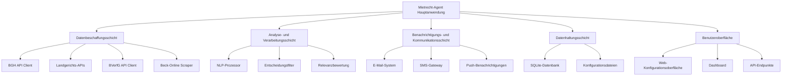

# Systemarchitektur des Mietrecht-Agenten

## Übersicht

Der Mietrecht-Agent ist ein automatisiertes System zur Überwachung und Analyse von Gerichtsentscheidungen im Bereich des Mietrechts. Das System besteht aus mehreren miteinander verbundenen Komponenten, die zusammenarbeiten, um relevante Informationen zu sammeln, zu analysieren und an interessierte Parteien weiterzuleiten.

## Architekturdiagramm

## Hauptkomponenten

### 1. Mietrecht-Agent Hauptanwendung ([mietrecht_agent.js](file:///d:/-%202025%20-%2022.06-%20copy%20C/_AA_Postfach%2001.01.2025/03.07.2025%20Arbeit%2002.11.2025/JurisMind%20-%20Mietrecht%2001/scripts/mietrecht_agent.js))

Die Hauptanwendung ist das Herzstück des Systems. Sie koordiniert alle anderen Komponenten und führt den Hauptworkflow aus:

- Regelmäßige Überprüfung auf neue Gerichtsentscheidungen
- Verarbeitung und Analyse neuer Entscheidungen
- Benachrichtigung relevanter Parteien
- Speicherung von Daten und Metriken

### 2. Datenbeschaffungsschicht

Diese Schicht ist für das Sammeln von Daten aus verschiedenen Quellen verantwortlich:

#### BGH API Client ([bghApiClient.js](file:///d:/-%202025%20-%2022.06-%20copy%20C/_AA_Postfach%2001.01.2025/03.07.2025%20Arbeit%2002.11.2025/JurisMind%20-%20Mietrecht%2001/scripts/data_sources/bghApiClient.js))
- Schnittstelle zur Bundesgerichtshof-API
- Abfrage neuer Entscheidungen basierend auf Suchkriterien

#### Landgerichts-APIs ([landgerichteClient.js](file:///d:/-%202025%20-%2022.06-%20copy%20C/_AA_Postfach%2001.01.2025/03.07.2025%20Arbeit%2002.11.2025/JurisMind%20-%20Mietrecht%2001/scripts/data_sources/landgerichteClient.js))
- Schnittstellen zu verschiedenen Landgerichtsdatenbanken
- Aggregation von Entscheidungen aus regionalen Gerichten

#### BVerfG API Client ([bverfgClient.js](file:///d:/-%202025%20-%2022.06-%20copy%20C/_AA_Postfach%2001.01.2025/03.07.2025%20Arbeit%2002.11.2025/JurisMind%20-%20Mietrecht%2001/scripts/data_sources/bverfgClient.js))
- Schnittstelle zum Bundesverfassungsgericht
- Abfrage verfassungsrechtlicher Entscheidungen mit Mietrechtsbezug

#### Beck-Online Scraper ([beckOnlineScraper.js](file:///d:/-%202025%20-%2022.06-%20copy%20C/_AA_Postfach%2001.01.2025/03.07.2025%20Arbeit%2002.11.2025/JurisMind%20-%20Mietrecht%2001/scripts/data_sources/beckOnlineScraper.js))
- Web-Scraping-Komponente für Beck-Online
- Extrahierung von Entscheidungen und Kommentaren

### 3. Analyse- und Verarbeitungsschicht

Diese Schicht verarbeitet die gesammelten Daten und wendet verschiedene Analysemethoden an:

#### NLP-Prozessor ([nlpProcessor.js](file:///d:/-%202025%20-%2022.06-%20copy%20C/_AA_Postfach%2001.01.2025/03.07.2025%20Arbeit%2002.11.2025/JurisMind%20-%20Mietrecht%2001/scripts/ai/nlpProcessor.js))
- Natürliche Sprachverarbeitung für Entscheidungstexte
- Extrahierung von Schlüsselbegriffen und Themen
- Zusammenfassung von Entscheidungsinhalten

#### Entscheidungsfilter ([decisionFilter.js](file:///d:/-%202025%20-%2022.06-%20copy%20C/_AA_Postfach%2001.01.2025/03.07.2025%20Arbeit%2002.11.2025/JurisMind%20-%20Mietrecht%2001/scripts/filters/decisionFilter.js))
- Filterung von Entscheidungen basierend auf Konfiguration
- Anwendung von Relevanzkriterien
- Ausschluss bereits verarbeiteter Entscheidungen

#### Relevanzbewertung ([relevanceAssessor.js](file:///d:/-%202025%20-%2022.06-%20copy%20C/_AA_Postfach%2001.01.2025/03.07.2025%20Arbeit%2002.11.2025/JurisMind%20-%20Mietrecht%2001/scripts/analysis/relevanceAssessor.js))
- Bewertung der Wichtigkeit von Entscheidungen
- Matching mit Anwaltspraxisschwerpunkten
- Priorisierung von Benachrichtigungen

### 4. Benachrichtigungs- und Kommunikationsschicht

Diese Schicht ist für die Kommunikation mit Benutzern und externen Systemen verantwortlich:

#### E-Mail-System ([notificationService.js](file:///d:/-%202025%20-%2022.06-%20copy%20C/_AA_Postfach%2001.01.2025/03.07.2025%20Arbeit%2002.11.2025/JurisMind%20-%20Mietrecht%2001/scripts/notifications/notificationService.js))
- Versand von E-Mail-Benachrichtigungen
- HTML-formatierte Entscheidungsberichte
- Unterstützung verschiedener E-Mail-Anbieter

#### SMS-Gateway
- Integration mit SMS-Diensten
- Kurzmitteilungen bei dringenden Entscheidungen
- Internationale Rufnummernunterstützung

#### Push-Benachrichtigungen
- Mobile Push-Benachrichtigungen
- Desktop-Benachrichtigungen
- Integration mit gängigen Messaging-Plattformen

### 5. Datenhaltungsschicht

Diese Schicht verwaltet die Speicherung und den Zugriff auf alle Daten:

#### SQLite-Datenbank ([connection.js](file:///d:/-%202025%20-%2022.06-%20copy%20C/_AA_Postfach%2001.01.2025/03.07.2025%20Arbeit%2002.11.2025/JurisMind%20-%20Mietrecht%2001/scripts/database/connection.js))
- Persistente Speicherung aller Entscheidungen
- Verwaltung von Anwaltsdaten und Präferenzen
- Speicherung von Systemmetriken und Logs

#### Konfigurationsdateien
- Zentrale Konfigurationsverwaltung
- Umgebungsspezifische Einstellungen
- Dynamische Konfigurationsaktualisierung

### 6. Benutzeroberfläche

Diese Schicht bietet Benutzern interaktive Zugriffsmöglichkeiten:

#### Web-Konfigurationsoberfläche ([web_config_server.js](file:///d:/-%202025%20-%2022.06-%20copy%20C/_AA_Postfach%2001.01.2025/03.07.2025%20Arbeit%2002.11.2025/JurisMind%20-%20Mietrecht%2001/scripts/web_config_server.js))
- Browserbasierte Konfiguration des Systems
- Verwaltung von Anwaltsprofilen
- Überwachung des Systemstatus

#### Dashboard ([dashboard.html](file:///d:/-%202025%20-%2022.06-%20copy%20C/_AA_Postfach%2001.01.2025/03.07.2025%20Arbeit%2002.11.2025/JurisMind%20-%20Mietrecht%2001/scripts/public/dashboard.html))
- Echtzeit-Anzeige von Systemmetriken
- Visualisierung von Analyseergebnissen
- Historische Datenansicht

#### API-Endpunkte ([web_config_server.js](file:///d:/-%202025%20-%2022.06-%20copy%20C/_AA_Postfach%2001.01.2025/03.07.2025%20Arbeit%2002.11.2025/JurisMind%20-%20Mietrecht%2001/scripts/web_config_server.js))
- RESTful API für externe Integration
- Programmatischer Zugriff auf Entscheidungsdaten
- Authentifizierung und Autorisierung

## Datenfluss

1. **Datensammlung**: Der Agent ruft regelmäßig Daten von verschiedenen Quellen ab
2. **Vorverarbeitung**: Rohdaten werden bereinigt und strukturiert
3. **Analyse**: NLP und andere Analysemethoden werden angewendet
4. **Filterung**: Entscheidungen werden nach Relevanz gefiltert
5. **Speicherung**: Verarbeitete Daten werden in der Datenbank gespeichert
6. **Benachrichtigung**: Relevante Entscheidungen werden an interessierte Parteien weitergeleitet
7. **Berichterstattung**: Analysen und Statistiken werden im Dashboard angezeigt

## Skalierbarkeit

Das System ist modular aufgebaut und kann leicht skaliert werden:

- **Horizontale Skalierung**: Mehrere Agent-Instanzen können parallel arbeiten
- **Vertikale Skalierung**: Einzelne Komponenten können unabhängig optimiert werden
- **Microservices-Architektur**: Komponenten können als separate Dienste bereitgestellt werden

## Sicherheit

- **Datenverschlüsselung**: Sensible Daten werden verschlüsselt gespeichert
- **Zugriffskontrolle**: Rollenbasierte Zugriffsrechte für verschiedene Benutzer
- **API-Sicherheit**: Token-basierte Authentifizierung für API-Zugriffe
- **Audit-Logging**: Vollständige Protokollierung aller Systemaktivitäten