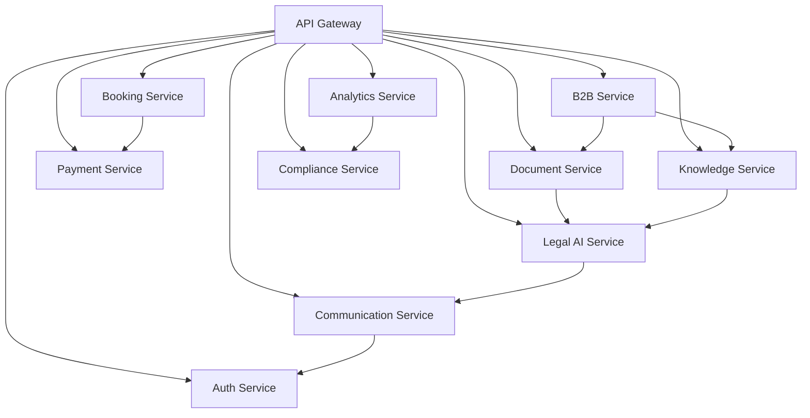

# Microservices Architecture Plan

## 1. Current Architecture

The current system is a monolithic approach with the following main components:

### 1.1 Controllers
- AuthController
- DocumentController
- RiskAssessmentController
- StrategyRecommendationsController
- UserController
- BookingController
- PaymentController
- KnowledgeController
- MietspiegelController
- MonitoringController
- B2BController

### 1.2 Services
- AuthService
- DocumentService (DocumentStorageService, DocumentAnalysisService, DocumentSharingService)
- RiskAssessmentService
- StrategyRecommendationService
- UserService
- BookingService
- PaymentService
- KnowledgeService
- MietspiegelService
- ChatService
- AnalyticsService
- ReportingService
- LegalDataImportService

### 1.3 Specialized Services
- NLPService
- EncryptionService
- EmailService
- AIResponseGenerator
- ComplianceServices (GDPR, Security)

## 2. Planned Microservices

### 2.1 Auth Service
**Responsible for:**
- User authentication
- Token management
- Session management
- Role and permission management

**Contains:**
- AuthController
- AuthService
- UserController
- UserRoutes

### 2.2 Document Service
**Responsible for:**
- Document storage and management
- Document analysis
- Document sharing
- Version control

**Contains:**
- DocumentController
- DocumentStorageService
- DocumentAnalysisService
- DocumentSharingService
- DocumentAnnotationService
- DocumentWorkflowService

### 2.3 Legal AI Service
**Responsible for:**
- Risk assessment
- Strategy recommendations
- NLP processing
- AI-powered analysis

**Contains:**
- RiskAssessmentController
- StrategyRecommendationsController
- RiskAssessmentService
- StrategyRecommendationService
- NLPService
- AIResponseGenerator

### 2.4 Booking Service
**Responsible for:**
- Lawyer referral
- Appointment booking
- Availability management

**Contains:**
- BookingController
- BookingService
- LawyerMatchingService

### 2.5 Payment Service
**Responsible for:**
- Payment processing
- Billing
- Refunds

**Contains:**
- PaymentController
- PaymentService
- StripePaymentService

### 2.6 Knowledge Service
**Responsible for:**
- Legal database
- Rent index data (Mietspiegel)
- Knowledge management

**Contains:**
- KnowledgeController
- KnowledgeService
- MietspiegelController
- MietspiegelService
- LegalDataImportService

### 2.7 Communication Service
**Responsible for:**
- Chat functionality
- Email sending
- Notifications

**Contains:**
- ChatService
- EmailService
- WebSocketService

### 2.8 Analytics Service
**Responsible for:**
- Usage analytics
- Reporting
- Data export

**Contains:**
- AnalyticsService
- ReportingService

### 2.9 Compliance Service
**Responsible for:**
- GDPR compliance
- Security monitoring
- Audit trails

**Contains:**
- GDPRComplianceService
- SecurityMonitoringService
- ComplianceReportingService
- AuditService

### 2.10 B2B Service
**Responsible for:**
- Business-to-business APIs
- Bulk processing
- Enterprise features

**Contains:**
- B2BController
- BulkProcessingService

## 3. Communication Patterns

### 3.1 Synchronous Communication
- RESTful APIs for direct service-to-service communication
- GraphQL for flexible data querying

### 3.2 Asynchronous Communication
- Message queues (RabbitMQ/Kafka) for event-driven communication
- Event streaming for real-time data processing

### 3.3 Service Discovery
- Consul for service discovery
- Load balancer for traffic distribution

## 4. Data Management

### 4.1 Database Strategy
- **Database per Service**: Each service has its own database
- **Event Sourcing**: For audit trail and history
- **CQRS**: Command Query Responsibility Segregation

### 4.2 Data Consistency
- **Sagas**: For distributed transactions
- **Eventual Consistency**: For non-critical data

## 5. Infrastructure

### 5.1 Containerization
- Docker for each service
- Docker Compose for local development
- Kubernetes for production

### 5.2 API Gateway
- Unified entry point
- Authentication and authorization
- Rate limiting
- Logging and monitoring

### 5.3 Monitoring and Logging
- Centralized Logging (ELK Stack)
- Distributed Tracing (Jaeger)
- Metrics Collection (Prometheus)
- Health Checks

## 6. Migration Steps

### 6.1 Phase 1: Identification and Separation
1. Analyze existing dependencies
2. Define service boundaries
3. Create interface specifications

### 6.2 Phase 2: Core Services
1. Create Auth Service
2. Create Document Service
3. Create Legal AI Service

### 6.3 Phase 3: Specialized Services
1. Migrate Booking Service
2. Migrate Payment Service
3. Migrate Knowledge Service

### 6.4 Phase 4: Infrastructure
1. Implement API Gateway
2. Set up Service Discovery

## 7. Service Dependencies

## 8. Technology Stack per Service

### 8.1 Auth Service
- Node.js/Express
- PostgreSQL
- Redis (sessions)
- JWT

### 8.2 Document Service
- Node.js/Express
- PostgreSQL
- MinIO (file storage)
- Redis (caching)
- ClamAV (virus scanning)

### 8.3 Legal AI Service
- Python/Flask (for AI components)
- Node.js/Express (for API layer)
- PostgreSQL
- Redis (caching)
- OpenAI API

### 8.4 Booking Service
- Node.js/Express
- PostgreSQL
- Redis (availability cache)

### 8.5 Payment Service
- Node.js/Express
- PostgreSQL
- Stripe API

### 8.6 Knowledge Service
- Node.js/Express
- PostgreSQL
- Elasticsearch
- Redis (caching)

### 8.7 Communication Service
- Node.js/Express
- PostgreSQL
- Redis (pub/sub)
- WebSocket server

### 8.8 Analytics Service
- Node.js/Express
- PostgreSQL
- Redis (caching)
- Elasticsearch (for logs)

### 8.9 Compliance Service
- Node.js/Express
- PostgreSQL
- Redis (caching)

### 8.10 B2B Service
- Node.js/Express
- PostgreSQL
- Redis (job queue)
- MinIO (bulk file storage)

## 9. Security Considerations

- Each service has its own authentication mechanism
- Service-to-service communication uses mutual TLS
- API keys and OAuth 2.0 for external access
- Regular security audits for each service
- Penetration testing for critical services

## 10. Deployment Strategy

- Blue-green deployments for zero-downtime updates
- Canary releases for new features
- Rolling updates for non-breaking changes
- Automated rollback on failures

## 11. Monitoring and Observability

- Health checks for each service
- Distributed tracing with correlation IDs
- Centralized logging with structured logs
- Custom metrics for business KPIs
- Alerting for critical service issues