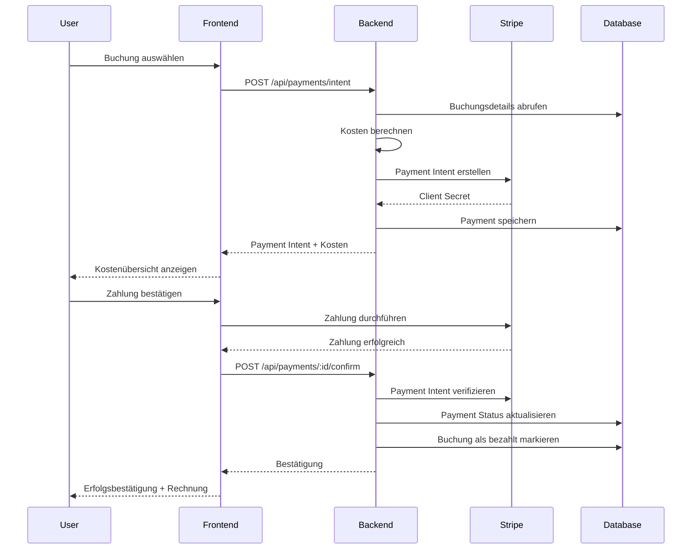

# Payment System - Preisgestaltung und Transparenz

## Übersicht

Das SmartLaw Payment System gewährleistet vollständige Transparenz bei der Berechnung und Abwicklung von Anwaltsgebühren. Dieses Dokument beschreibt die Kostenstrukturen, Berechnungsmethoden und Transparenzmaßnahmen.

## Kostenstruktur

### Anwaltsgebühren

Die Gebühren für Rechtsberatungen werden nach folgendem Schema berechnet:

```typescript
Gesamtkosten = Stundensatz × (Dauer in Minuten / 60)
```

**Beispielrechnung:**
- Stundensatz: 180 €/Stunde
- Beratungsdauer: 60 Minuten
- Netto-Kosten: 180 € × (60 / 60) = 180 €
- MwSt. (19%): 34,20 €
- **Gesamtkosten: 214,20 €**

### Stundensätze

Anwälte legen ihre eigenen Stundensätze fest. Typische Bereiche:

| Erfahrungsstufe | Stundensatz |
|----------------|-------------|
| Junior-Anwalt | 120 - 150 € |
| Erfahrener Anwalt | 150 - 200 € |
| Spezialist | 200 - 300 € |
| Partner/Senior | 300 - 500 € |

**Standard-Stundensatz:** 150 € (wird verwendet, wenn kein spezifischer Satz hinterlegt ist)

### Mehrwertsteuer

Alle Preise verstehen sich zzgl. 19% deutscher Mehrwertsteuer gemäß § 19 UStG.

```typescript
Netto-Betrag = Beratungskosten
MwSt. = Netto-Betrag × 0,19
Brutto-Betrag = Netto-Betrag + MwSt.
```

## Transparenzmaßnahmen

### 1. Vorab-Kostenschätzung

Vor jeder Buchung wird dem Nutzer eine detaillierte Kostenschätzung angezeigt:

```json
{
  "lawyer": {
    "name": "Dr. Schmidt",
    "hourlyRate": 180,
    "specialization": "Mietrecht"
  },
  "booking": {
    "duration": 60,
    "meetingType": "VIDEO"
  },
  "costs": {
    "netAmount": 18000,
    "taxAmount": 3420,
    "totalAmount": 21420,
    "currency": "EUR",
    "breakdown": {
      "hourlyRate": "180,00 €",
      "duration": "60 Minuten",
      "netCost": "180,00 €",
      "vat": "34,20 € (19%)",
      "total": "214,20 €"
    }
  }
}
```

### 2. Echtzeit-Berechnung

Die Kosten werden in Echtzeit basierend auf der gewählten Zeitslot-Dauer berechnet:

```typescript
// services/backend/src/services/PaymentService.ts
private calculateDuration(startTime: Date, endTime: Date): number {
  return Math.round((endTime.getTime() - startTime.getTime()) / (1000 * 60));
}

const duration = this.calculateDuration(
  booking.timeSlot.startTime,
  booking.timeSlot.endTime
);
const hourlyRate = booking.lawyer.hourlyRate || 150;
const amount = Math.round((hourlyRate / 60) * duration * 100); // in Cent
```

### 3. Detaillierte Rechnungen

Nach Abschluss der Zahlung wird automatisch eine detaillierte Rechnung generiert:

**Rechnungsbestandteile:**
- Rechnungsnummer (Format: INV-YYYYMM-XXXX)
- Ausstellungsdatum
- Leistungsbeschreibung
- Einzelposten mit Menge und Einheitspreis
- Netto-Betrag
- Mehrwertsteuer (19%)
- Brutto-Gesamtbetrag
- Zahlungsinformationen

**Beispiel-Rechnung:**

```
Rechnung Nr.: INV-202401-0042
Datum: 15.01.2024

Leistungsbeschreibung:
- Rechtsberatung - Dr. Schmidt
  Menge: 60 Minuten
  Einheitspreis: 3,00 €/Minute
  Gesamt: 180,00 €

Netto-Betrag:        180,00 €
MwSt. (19%):          34,20 €
─────────────────────────────
Gesamtbetrag:        214,20 €

Status: Bezahlt am 15.01.2024
Zahlungsmethode: Kreditkarte
```

### 4. Kostenübersicht im Profil

Nutzer können jederzeit eine Übersicht aller Zahlungen einsehen:

```typescript
GET /api/payments

Response:
{
  "success": true,
  "data": [
    {
      "id": "payment-123",
      "date": "2024-01-15T10:00:00Z",
      "lawyer": "Dr. Schmidt",
      "amount": 21420,
      "status": "COMPLETED",
      "invoiceUrl": "/api/invoices/inv-123/pdf"
    }
  ],
  "summary": {
    "totalSpent": 42840,
    "numberOfConsultations": 2,
    "averageCost": 21420
  }
}
```

## Zahlungsabwicklung

### Unterstützte Zahlungsmethoden

1. **Kreditkarte** (Visa, Mastercard, American Express)
2. **Debitkarte**
3. **SEPA-Lastschrift** (geplant)
4. **PayPal** (geplant)

### Zahlungsablauf



### Sicherheit

- **PCI DSS Compliance:** Alle Zahlungsdaten werden über Stripe verarbeitet
- **Keine Kartendaten-Speicherung:** Kartendaten werden niemals auf unseren Servern gespeichert
- **3D Secure:** Unterstützung für zusätzliche Authentifizierung
- **Verschlüsselung:** Alle Transaktionen über TLS 1.3
- **Tokenisierung:** Verwendung von Stripe Payment Tokens

## Rückerstattungen

### Rückerstattungsrichtlinien

**Vollständige Rückerstattung:**
- Absage durch den Anwalt: 100% Rückerstattung
- Technische Probleme: 100% Rückerstattung
- Absage >24h vor Termin: 100% Rückerstattung

**Teilrückerstattung:**
- Absage <24h vor Termin: 50% Rückerstattung
- Verspätete Absage: Nach Ermessen

**Keine Rückerstattung:**
- Nichterscheinen ohne Absage
- Absage <2h vor Termin

### Rückerstattungsprozess

```typescript
POST /api/payments/:paymentId/refund

Request:
{
  "amount": 10000,  // Optional: Teilerstattung in Cent
  "reason": "Termin wurde vom Anwalt abgesagt"
}

Response:
{
  "success": true,
  "data": {
    "paymentId": "payment-123",
    "refundAmount": 21420,
    "status": "REFUNDED",
    "refundedAt": "2024-01-16T10:00:00Z",
    "estimatedArrival": "2024-01-20T00:00:00Z"
  }
}
```

**Bearbeitungszeit:**
- Kreditkarte: 5-10 Werktage
- Debitkarte: 5-10 Werktage
- SEPA: 2-3 Werktage

## Anwalts-Auszahlungen

### Auszahlungsmodell

Anwälte erhalten ihre Vergütung nach folgendem Schema:

```typescript
Anwalts-Anteil = Brutto-Betrag × 0,85  // 85% des Brutto-Betrags
Plattform-Gebühr = Brutto-Betrag × 0,15  // 15% Plattform-Gebühr
```

**Beispiel:**
- Brutto-Betrag: 214,20 €
- Anwalts-Anteil: 182,07 €
- Plattform-Gebühr: 32,13 €

### Auszahlungsrhythmus

- **Wöchentlich:** Jeden Montag für abgeschlossene Beratungen der Vorwoche
- **Mindestauszahlung:** 50 €
- **Auszahlungsmethode:** SEPA-Überweisung

### Anwalts-Dashboard

Anwälte haben Zugriff auf detaillierte Statistiken:

```typescript
GET /api/payments/lawyers/:lawyerId/stats

Response:
{
  "success": true,
  "data": {
    "totalEarnings": 182070,  // in Cent
    "pendingPayments": 2,
    "completedPayments": 15,
    "refundedPayments": 1,
    "currentMonth": {
      "earnings": 45000,
      "consultations": 5
    },
    "nextPayout": {
      "amount": 90000,
      "date": "2024-01-22",
      "consultations": 10
    }
  }
}
```

## Compliance und Rechtliches

### Steuerliche Behandlung

- **Umsatzsteuer:** 19% MwSt. wird auf alle Beratungsleistungen erhoben
- **Rechnungsstellung:** Automatische Rechnungserstellung gemäß § 14 UStG
- **Aufbewahrung:** Rechnungen werden 10 Jahre gespeichert (§ 147 AO)

### Datenschutz

- **DSGVO-konform:** Alle Zahlungsdaten werden DSGVO-konform verarbeitet
- **Datenminimierung:** Nur notwendige Zahlungsinformationen werden gespeichert
- **Löschfristen:** Zahlungsdaten werden nach gesetzlichen Aufbewahrungsfristen gelöscht

### AGB-Hinweise

Nutzer müssen vor der ersten Zahlung folgende Punkte akzeptieren:

1. Allgemeine Geschäftsbedingungen
2. Widerrufsbelehrung (§ 312g BGB)
3. Datenschutzerklärung
4. Zahlungsbedingungen

## API-Endpunkte

### Übersicht aller Payment-Endpunkte

```typescript
// Payment Intent erstellen
POST /api/payments/intent
Body: { bookingId: string }
Response: PaymentIntent

// Zahlung bestätigen
POST /api/payments/:paymentId/confirm
Body: { transactionId: string }
Response: PaymentDetails

// Zahlungsdetails abrufen
GET /api/payments/:paymentId
Response: PaymentDetails

// Alle Zahlungen auflisten
GET /api/payments
Response: PaymentDetails[]

// Rechnung generieren
POST /api/payments/:paymentId/invoice
Response: Invoice

// Rechnung abrufen
GET /api/invoices/:invoiceId
Response: Invoice

// Rückerstattung erstellen
POST /api/payments/:paymentId/refund
Body: { amount?: number, reason: string }
Response: PaymentDetails

// Anwalts-Statistiken
GET /api/payments/lawyers/:lawyerId/stats
Response: PaymentStats
```

## Best Practices

### Für Entwickler

1. **Immer Beträge in Cent speichern** um Rundungsfehler zu vermeiden
2. **Idempotenz sicherstellen** bei Payment-Operationen
3. **Webhooks implementieren** für asynchrone Zahlungsbestätigungen
4. **Fehlerbehandlung** für alle Stripe-API-Calls
5. **Logging** aller Zahlungsvorgänge für Audit-Zwecke

### Für Nutzer

1. **Kosten vor Buchung prüfen**
2. **Rechnung herunterladen** für Steuerunterlagen
3. **Stornierungsfristen beachten**
4. **Bei Problemen Support kontaktieren**

## Support

Bei Fragen zu Zahlungen oder Rechnungen:

- **E-Mail:** payment-support@smartlaw.de
- **Telefon:** +49 30 1234567
- **Öffnungszeiten:** Mo-Fr 9:00-18:00 Uhr

## Changelog

### Version 1.0.0 (Januar 2024)
- Initiale Implementierung
- Stripe-Integration
- Automatische Rechnungserstellung
- Rückerstattungsfunktion
- Anwalts-Auszahlungen
