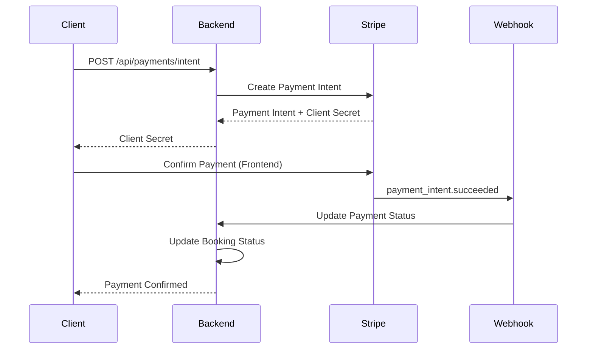

# Stripe Payment Integration

## Übersicht

Die SmartLaw Mietrecht-Anwendung verwendet Stripe als Payment Gateway für die sichere Abwicklung von Anwaltsgebühren. Diese Dokumentation beschreibt die vollständige Integration und Konfiguration.

## Features

- ✅ **Payment Intents**: Sichere Zahlungsabwicklung mit 3D Secure Support
- ✅ **Webhooks**: Asynchrone Benachrichtigungen über Zahlungsstatus
- ✅ **Refunds**: Vollständige und teilweise Rückerstattungen
- ✅ **Metadata Tracking**: Verknüpfung von Zahlungen mit Buchungen
- ✅ **Receipt Emails**: Automatische Quittungen an Kunden
- ✅ **Multi-Currency**: Unterstützung für EUR (erweiterbar)
- ✅ **Error Handling**: Robuste Fehlerbehandlung für alle Stripe-Fehler

## Installation

### 1. Stripe Package installieren

```bash
cd services/backend
npm install stripe
```

### 2. Stripe Account einrichten

1. Erstelle einen Account auf [stripe.com](https://stripe.com)
2. Hole deine API-Keys aus dem Dashboard:
   - **Test Mode**: `sk_test_...` und `pk_test_...`
   - **Live Mode**: `sk_live_...` und `pk_live_...`

### 3. Umgebungsvariablen konfigurieren

```bash
# .env
USE_STRIPE=true
STRIPE_SECRET_KEY=sk_test_your_stripe_secret_key
STRIPE_PUBLISHABLE_KEY=pk_test_your_stripe_publishable_key
STRIPE_WEBHOOK_SECRET=whsec_your_webhook_secret
```

## Architektur

### Service-Struktur

```
services/backend/src/
├── services/
│   ├── PaymentService.ts          # Mock-Service für Entwicklung
│   └── StripePaymentService.ts    # Stripe-Integration
├── controllers/
│   ├── PaymentController.ts       # Payment API Endpunkte
│   └── StripeWebhookController.ts # Webhook Handler
└── routes/
    ├── payment.ts                 # Payment Routes
    └── webhook.ts                 # Webhook Routes
```

### Datenfluss



## API Endpunkte

### 1. Payment Intent erstellen

Erstellt einen Stripe Payment Intent für eine Buchung.

```http
POST /api/payments/intent
Authorization: Bearer <jwt-token>
Content-Type: application/json

{
  "bookingId": "booking-123"
}
```

**Response:**

```json
{
  "success": true,
  "data": {
    "id": "payment-123",
    "amount": 18000,
    "currency": "EUR",
    "status": "PENDING",
    "clientSecret": "pi_xxx_secret_yyy",
    "metadata": {
      "bookingId": "booking-123",
      "userId": "user-123",
      "lawyerId": "lawyer-123"
    }
  }
}
```

### 2. Zahlung bestätigen

Bestätigt eine Zahlung nach erfolgreicher Stripe-Transaktion.

```http
POST /api/payments/:paymentId/confirm
Authorization: Bearer <jwt-token>
Content-Type: application/json

{
  "transactionId": "pi_stripe_123"
}
```

### 3. Rückerstattung erstellen

Erstellt eine vollständige oder teilweise Rückerstattung.

```http
POST /api/payments/:paymentId/refund
Authorization: Bearer <jwt-token>
Content-Type: application/json

{
  "amount": 9000,
  "reason": "Stornierung durch Nutzer"
}
```

## Webhook-Integration

### Webhook einrichten

1. Gehe zu [Stripe Dashboard > Developers > Webhooks](https://dashboard.stripe.com/webhooks)
2. Klicke auf "Add endpoint"
3. URL eingeben: `https://your-domain.com/api/webhooks/stripe`
4. Events auswählen:
   - `payment_intent.succeeded`
   - `payment_intent.payment_failed`
   - `charge.refunded`
5. Webhook-Secret kopieren und in `.env` eintragen

### Webhook-Endpunkt

```http
POST /api/webhooks/stripe
Stripe-Signature: <stripe-signature-header>
Content-Type: application/json

{
  "type": "payment_intent.succeeded",
  "data": {
    "object": {
      "id": "pi_stripe_123",
      "status": "succeeded"
    }
  }
}
```

### Unterstützte Events

| Event | Beschreibung | Aktion |
|-------|--------------|--------|
| `payment_intent.succeeded` | Zahlung erfolgreich | Payment Status → COMPLETED |
| `payment_intent.payment_failed` | Zahlung fehlgeschlagen | Payment Status → FAILED |
| `charge.refunded` | Rückerstattung durchgeführt | Payment Status → REFUNDED |

## Frontend-Integration

### React/TypeScript Beispiel

```typescript
import { loadStripe } from '@stripe/stripe-js';
import { Elements, PaymentElement, useStripe, useElements } from '@stripe/react-stripe-js';

// Stripe initialisieren
const stripePromise = loadStripe(process.env.REACT_APP_STRIPE_PUBLISHABLE_KEY!);

function CheckoutForm({ clientSecret }: { clientSecret: string }) {
  const stripe = useStripe();
  const elements = useElements();

  const handleSubmit = async (e: React.FormEvent) => {
    e.preventDefault();

    if (!stripe || !elements) return;

    const { error, paymentIntent } = await stripe.confirmPayment({
      elements,
      confirmParams: {
        return_url: `${window.location.origin}/payment/success`,
      },
    });

    if (error) {
      console.error('Payment failed:', error);
    } else if (paymentIntent.status === 'succeeded') {
      // Bestätige Zahlung im Backend
      await fetch(`/api/payments/${paymentId}/confirm`, {
        method: 'POST',
        headers: {
          'Content-Type': 'application/json',
          'Authorization': `Bearer ${token}`
        },
        body: JSON.stringify({
          transactionId: paymentIntent.id
        })
      });
    }
  };

  return (
    <form onSubmit={handleSubmit}>
      <PaymentElement />
      <button type="submit" disabled={!stripe}>
        Zahlung durchführen
      </button>
    </form>
  );
}

function PaymentPage({ bookingId }: { bookingId: string }) {
  const [clientSecret, setClientSecret] = useState('');

  useEffect(() => {
    // Payment Intent erstellen
    fetch('/api/payments/intent', {
      method: 'POST',
      headers: {
        'Content-Type': 'application/json',
        'Authorization': `Bearer ${token}`
      },
      body: JSON.stringify({ bookingId })
    })
      .then(res => res.json())
      .then(data => setClientSecret(data.data.clientSecret));
  }, [bookingId]);

  return (
    <Elements stripe={stripePromise} options={{ clientSecret }}>
      <CheckoutForm clientSecret={clientSecret} />
    </Elements>
  );
}
```

## Sicherheit

### Best Practices

1. **API Keys schützen**
   - Niemals Secret Keys im Frontend verwenden
   - Nur Publishable Keys im Client-Code
   - Keys in Umgebungsvariablen speichern

2. **Webhook-Signatur verifizieren**
   - Immer `stripe.webhooks.constructEvent()` verwenden
   - Webhook-Secret sicher speichern
   - Ungültige Signaturen ablehnen

3. **Idempotenz**
   - Stripe verwendet Idempotency Keys
   - Verhindert doppelte Zahlungen bei Netzwerkfehlern

4. **PCI Compliance**
   - Keine Kartendaten im Backend speichern
   - Stripe Elements für sichere Eingabe verwenden
   - TLS 1.2+ für alle Verbindungen

## Testing

### Unit Tests

```bash
npm test -- stripePaymentService.test.ts
```

### Test-Karten

Stripe bietet Test-Karten für verschiedene Szenarien:

| Kartennummer | Szenario |
|--------------|----------|
| 4242 4242 4242 4242 | Erfolgreiche Zahlung |
| 4000 0000 0000 9995 | Abgelehnte Karte |
| 4000 0025 0000 3155 | 3D Secure erforderlich |
| 4000 0000 0000 0341 | Karte mit Fehler |

### Webhook Testing

Verwende Stripe CLI für lokales Webhook-Testing:

```bash
# Stripe CLI installieren
brew install stripe/stripe-cli/stripe

# Login
stripe login

# Webhooks weiterleiten
stripe listen --forward-to localhost:3001/api/webhooks/stripe

# Test-Event senden
stripe trigger payment_intent.succeeded
```

## Monitoring

### Metriken

- **Payment Success Rate**: Erfolgreiche Zahlungen / Gesamt
- **Average Payment Time**: Durchschnittliche Zahlungsdauer
- **Refund Rate**: Rückerstattungen / Gesamt
- **Failed Payments**: Fehlgeschlagene Zahlungen

### Logging

Alle Stripe-Interaktionen werden geloggt:

```typescript
logger.info('Stripe payment intent created', {
  paymentId: payment.id,
  stripeIntentId: stripeIntent.id,
  amount
});

loggers.businessEvent('PAYMENT_CONFIRMED', userId, {
  paymentId,
  stripeIntentId,
  amount
});
```

### Stripe Dashboard

Überwache Zahlungen im [Stripe Dashboard](https://dashboard.stripe.com):
- Zahlungsübersicht
- Fehlerberichte
- Webhook-Logs
- Rückerstattungen

## Fehlerbehandlung

### Stripe-Fehlertypen

```typescript
try {
  await stripe.paymentIntents.create(...);
} catch (error) {
  if (error instanceof Stripe.errors.StripeCardError) {
    // Kartenfehler (z.B. abgelehnt)
    console.error('Card error:', error.message);
  } else if (error instanceof Stripe.errors.StripeInvalidRequestError) {
    // Ungültige Anfrage
    console.error('Invalid request:', error.message);
  } else if (error instanceof Stripe.errors.StripeAPIError) {
    // Stripe API Fehler
    console.error('API error:', error.message);
  } else if (error instanceof Stripe.errors.StripeConnectionError) {
    // Netzwerkfehler
    console.error('Connection error:', error.message);
  }
}
```

### Retry-Strategie

Bei temporären Fehlern automatisch wiederholen:

```typescript
const maxRetries = 3;
let attempt = 0;

while (attempt < maxRetries) {
  try {
    return await stripe.paymentIntents.create(...);
  } catch (error) {
    if (error instanceof Stripe.errors.StripeConnectionError && attempt < maxRetries - 1) {
      attempt++;
      await new Promise(resolve => setTimeout(resolve, 1000 * attempt));
    } else {
      throw error;
    }
  }
}
```

## Kosten

### Stripe-Gebühren (Deutschland)

- **Europäische Karten**: 1,4% + 0,25€ pro Transaktion
- **Nicht-europäische Karten**: 2,9% + 0,25€ pro Transaktion
- **Rückerstattungen**: Gebühren werden nicht erstattet

### Beispielrechnung

```
Beratungsgebühr: 180,00€
Stripe-Gebühr: 2,77€ (1,4% + 0,25€)
Netto-Einnahme: 177,23€
```

## Migration von Mock zu Stripe

### Schritt 1: Konfiguration

```bash
# .env
USE_STRIPE=true
STRIPE_SECRET_KEY=sk_test_...
STRIPE_PUBLISHABLE_KEY=pk_test_...
STRIPE_WEBHOOK_SECRET=whsec_...
```

### Schritt 2: Frontend anpassen

Installiere Stripe React Components:

```bash
npm install @stripe/stripe-js @stripe/react-stripe-js
```

### Schritt 3: Testen

1. Teste mit Stripe Test-Karten
2. Verifiziere Webhook-Events
3. Prüfe Rückerstattungen

### Schritt 4: Live-Betrieb

1. Wechsle zu Live-Keys
2. Aktiviere Webhooks in Produktion
3. Überwache erste Transaktionen

## Troubleshooting

### Problem: Webhook wird nicht empfangen

**Lösung:**
- Prüfe Webhook-URL in Stripe Dashboard
- Verifiziere Firewall-Einstellungen
- Teste mit Stripe CLI lokal

### Problem: Payment Intent schlägt fehl

**Lösung:**
- Prüfe API-Keys
- Verifiziere Betrag (muss > 0 sein)
- Prüfe Stripe-Logs im Dashboard

### Problem: 3D Secure funktioniert nicht

**Lösung:**
- Stelle sicher dass `automatic_payment_methods` aktiviert ist
- Verwende neueste Stripe.js Version
- Teste mit 3D Secure Test-Karte

## Support

- **Stripe Dokumentation**: https://stripe.com/docs
- **Stripe Support**: https://support.stripe.com
- **Status Page**: https://status.stripe.com
- **Community**: https://github.com/stripe

## Changelog

### Version 1.0.0 (2024-01-15)
- ✅ Initiale Stripe-Integration
- ✅ Payment Intents API
- ✅ Webhook-Handler
- ✅ Refund-Funktionalität
- ✅ Umfassende Tests
- ✅ Dokumentation
